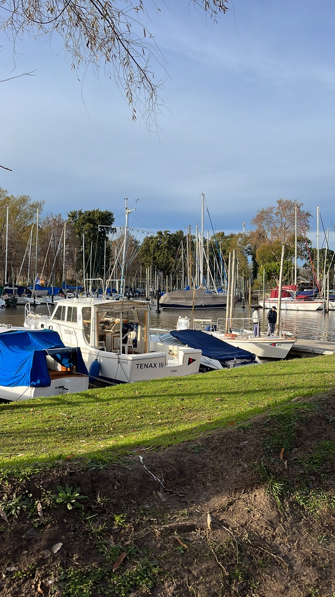

# Inicio 
 

https://asackmann.github.io/CursoMeteorologia2024/

- [Inicio](#inicio)
- [Curso Meteorologia 1do Sem 2024](#curso-meteorologia-1do-sem-2024)
  - [Programa del curso](#programa-del-curso)
  - [Fechas](#fechas)
  - [Modalidad](#modalidad)

# Curso Meteorologia 1do Sem 2024

Curso de Meteorología! 2024

- Prof Norberto Cattaneo
- Para navegantes y público en general
- Inicio: 9 de abril de 2024
- Duración 13 Clases 
- Todos los martes de 19 a 21 h
- Costo del curso $82.000 en 3 cuotas, junto con la cuota social
- Totalmente presencial, Salón POLLITZER, Edificio Principal, Prof Norberto Cattaneo

## Programa del curso

El Programa del Curso Nivel 1 tiene como objetivo impartir los conceptos básicos de Meteorología que permita analizar la información disponible de distintas fuentes para hacer pronósticos meteorológicos (nivel no profesional) que ayuden a la navegación y a la seguridad a bordo

Durante el curso se verán los siguientes temas:
- Climatología Regional
- Conceptos sobre el Viento Geostrófico, Real y De Gradiente
- Ciclones y Frentes y Anticiclones Migratorios
- Tormentas
- Nieblas
- Situaciones Típicas, Pampero, Sudestada.
- Brisas
- Descripción y utilización de herramientas digitales recomendadas ( Ogimet, Windy, NOAA, GOES, Norden, Radares etc)

Se realiza práctica intensiva en casa clase sobre pronóstico e interpretación de imágenes de satélite y radar meteorológico.

## Fechas
-  
---
## Modalidad
- 13 clases teoricas 
	- Martes 19hs. 

-----------------
